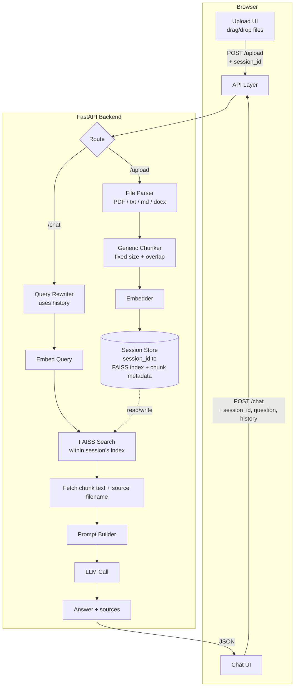

# Architecture — General-Purpose Document Q&A Chatbot

## 1. Key Shift From the FAQ Version

The FAQ version had a **static, offline-built index** (ingest once, serve forever). This version needs **dynamic, per-session ingestion**: any user can upload documents at any time, and the system must parse, chunk, embed, and index them on the fly, scoped to that user's session, combined into one knowledge base per session (per your scoping decision).

This means ingestion is no longer a separate offline script — it's now a live part of the backend, triggered by an upload request.

## 2. High-Level Diagram



## 3. Components

### 3.1 File Upload & Parsing
- **Endpoint**: `POST /upload` accepts one or more files plus a `session_id`
- **Format-specific parsers**:
  - PDF → `pypdf` or `pdfplumber` for text extraction
  - .docx → `python-docx`
  - .txt/.md → direct read
- Each parser must handle failure gracefully (e.g., scanned PDF with no extractable text) and return a clear error rather than silently producing an empty document
- Extracted text is tagged with its source filename before chunking, so citations can reference "which document" later

### 3.2 Generic Chunker
- Since documents are arbitrary (not neat Q&A pairs like the FAQ version), chunking is now **fixed-size with overlap** (e.g., ~500 tokens per chunk, ~50-token overlap) — a standard, well-understood approach for general text
- Each chunk retains metadata: `{text, source_filename, chunk_index}`

### 3.3 Embedder
- Same embedding model used consistently for both document chunks and user queries (this constraint doesn't change from the FAQ version — it's still critical)

### 3.4 Session Store (the main new piece)
- An in-memory structure (e.g., a Python dict) keyed by `session_id`, where each entry holds:
  - A FAISS index (built incrementally — new uploads add vectors to the existing session index rather than rebuilding from scratch)
  - The chunk metadata list for that session
  - The list of uploaded document names (for display in the UI)
- **v1 scope**: this lives only in server memory. Restarting the server loses all sessions. This is a documented, deliberate limitation — persisting sessions (e.g., to disk or a lightweight DB like SQLite) is a natural "phase 2" improvement, not part of the initial MVP
- `session_id` is generated client-side (a UUID stored in the browser, e.g., in a JS variable or `localStorage`) and sent with every request — no server-side auth needed

### 3.5 FastAPI Backend
- `POST /upload`: parses + chunks + embeds new files, adds vectors to the session's FAISS index (creating one if it doesn't exist yet), returns the updated document list
- `POST /chat`: as in the FAQ version — rewrite query using history, embed, search **within that session's index only**, build prompt, call LLM, return answer + sources
- Both endpoints validate `session_id` is present; if a session has no index yet, `/chat` should respond clearly ("upload a document first") rather than erroring unhelpfully

### 3.6 Frontend
- Two visible areas: an upload/document panel (drag-drop or file picker, showing uploaded file names and a small "processing..." state during embedding) and the chat panel (as before)
- Session ID generated once per page load (or persisted in `localStorage` for the browser tab) and included in every request automatically

## 4. Data Flow

**Upload flow:**
1. User drags/selects files → JS sends them via `POST /upload` with the session ID
2. Backend parses each file by type, extracts text, chunks it, embeds chunks
3. Backend adds new vectors to the session's FAISS index (or creates one if this is the first upload), updates the metadata list
4. Backend returns the current list of documents in the session; frontend updates the document panel

**Chat flow:** unchanged in principle from the FAQ version, except retrieval is now scoped to `session_store[session_id]` instead of a single global index.

## 5. Tricky Integration Points (updated/new)

- **Incremental indexing**: FAISS's `IndexFlatL2`/`IndexFlatIP` support adding vectors after creation (`index.add()`), so new uploads can extend an existing session index without a full rebuild — but the parallel metadata list must be appended in the same order, or indices will point to the wrong chunk/text.
- **Session lifecycle**: with no expiry logic, memory grows unbounded across sessions in the strict MVP. A simple mitigation for a resume project: cap the number of concurrent sessions in memory, or add a basic time-based eviction (e.g., clear sessions inactive for 30+ minutes) as an early "phase 2" addition rather than leaving it fully unbounded even in the demo.
- **Multi-format parsing failures**: each parser needs its own try/except with a clear error surfaced to the frontend (e.g., "Could not extract text from this PDF — it may be scanned/image-based") rather than a generic 500 error.
- **Cross-document retrieval**: top-k search across a combined index means retrieved chunks may come from different documents in the same answer — the prompt and the source-citation logic both need to handle "multiple sources for one answer," not just one.
- **Consistent embedding model across the session's lifetime**: if you ever change the embedding model in code, existing sessions' indices become incompatible with new queries — this only matters if you redeploy mid-session, but worth knowing.

## 6. File/Folder Structure (updated)

```
document-qa-bot/
├── app/
│   ├── main.py                 # FastAPI app, /upload and /chat endpoints
│   ├── parsers/
│   │   ├── pdf_parser.py
│   │   ├── docx_parser.py
│   │   └── text_parser.py
│   ├── chunker.py               # generic fixed-size + overlap chunking
│   ├── embedder.py
│   ├── session_store.py         # in-memory session_id -> {index, chunks, docs}
│   ├── retriever.py
│   ├── prompt.py
│   ├── llm.py
│   └── models.py                # Pydantic schemas
├── static/
│   ├── index.html
│   ├── style.css
│   └── script.js
├── tests/
│   └── test_questions.json
├── architecture.md
├── design.md
├── phases.md
├── prd.md
└── README.md
```

Note: there's no more standalone `ingest/` offline pipeline or pre-built `index/` folder — indexing is now fully runtime, living in `session_store.py`.

## 7. Deployment

- Free-tier host (Render/Railway) — same as before
- No persistent storage needed since sessions are memory-only in v1; be aware some free hosts spin down idle instances, which would clear all active sessions — worth a one-line note in the README as a known limitation, not a bug
